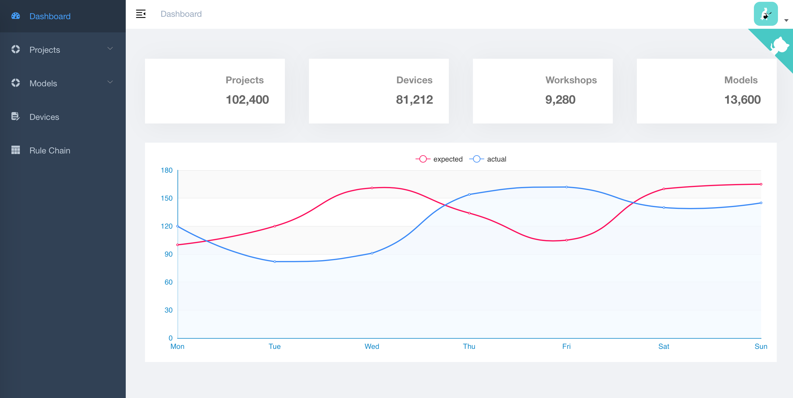

# pandas-dashboard



## Build Setup


```bash
# clone the project
git clone https://github.com/cloudstone/pandas-dashboard.git

# enter the project directory
cd pandas-dashboard 

# install dependency
npm install

# develop
npm run dev
```

This will automatically open http://localhost:9528

## Build

```bash
# build for test environment
npm run build:stage

# build for production environment
npm run build:prod
```

## Advanced

```bash
# preview the release environment effect
npm run preview

# preview the release environment effect + static resource analysis
npm run preview -- --report

# code format check
npm run lint

# code format check and auto fix
npm run lint -- --fix
```
